## 一、信息梳理‌‌

时间： 9 月 17 日下午 14:00

地点： 左右家私多功能会议厅

邀请人数： 100 人左右

参会人员： 公司员工、领导、设计师、媒体代表

本次活动分为上下两场、分别为启动大会和新品发布会。

## 二、主题策划

因两场活动的侧重点不同， 所以建议采取不同的主题。

### 1、启动大会

启动大会最重要的目的是，通过签军令状等活动环节的仪式感，增强员工个人的目标感、荣誉感， 从而提升团队使命感、凝聚力。提振士气、全面冲击双十一销量目标。

根据已经拟好的流程环节，包括直升机降落入场，队列检阅以及决战到天明的口号， 都有着浓郁的“战斗”风格。

因此可以将主题拟定为此风格， 从现场布场到流程仪式再到视频配合，全部统一风格。并以电影式海报为主要布场物料，烘托出活动现场氛围的史诗感。

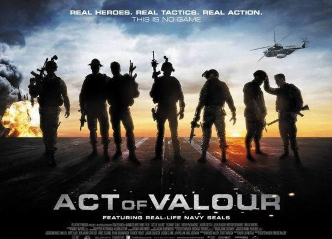

&emsp;&emsp;&emsp;&emsp;&emsp;&emsp;&emsp;&emsp;&emsp;&emsp;&emsp;&emsp;&emsp;（主题海报风格参考）‌

启动大会主题：

1、来战！ 杀出个黎明！

主题 logo 设计： 突出来战！ 两个字， 做成军令牌的样式。
 
2、热血赴战场， 决胜双十一！

主题 logo 设计： 战斗风格。

### 2、新品发布会

新品发布会是左右家私对外宣传的窗口，本次发布会既要传达出左右家私的品牌理念， 更是要正式推出旗下的十大系列产品。

因此主题和风格， 应该贴近我们的企业品牌调性和产品本身的性质。突出我们的产品“绿色、环保、舒适”能够为消费者营造一个时尚安心的家。

本次新品发布会整体风格要更加简约、时尚一些。风格贴近苹果发布会等科技产品的发布会。

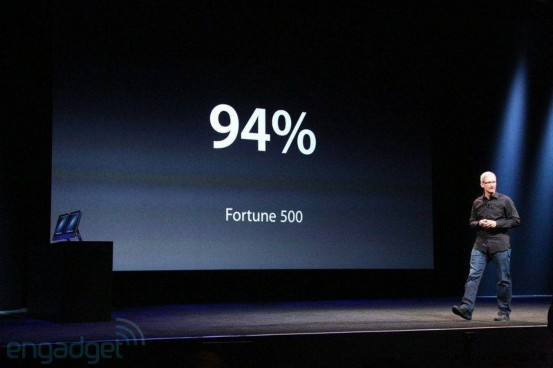

&emsp;&emsp;&emsp;&emsp;&emsp;&emsp;&emsp;&emsp;&emsp;&emsp;&emsp;&emsp;&emsp;（发布会风格参考）

发布会主题，既要能体现出左右家私的品牌理念，又能烘托营造出家的氛围。以下为拟定发布会主题， 具体需要配合新品风格来确定。

新品发布会主题：

1、诗与远方， 尽在左右。

主题阐述： 左右家私， 让你不用再向往诗与远方， 最美的风景， 回家欣赏。适合新产品外观设计感强， 风格都为时尚简约型时选用。

2、理想·家

主题阐述： 一语三关， 即可指代设计师和左右家私， 是有着更高追求的理想家。也可代表我们将为消费者设计提供一个理想的家。适合发布注重舒适感， 能够营造较强场景的新产品时选用。

3、幸福不远， 就在左右。

主题阐述：左右家私的 slogan 本身就很强的感染力和适用性，可以直接使用， 增强宣传力度。适合新产品风格多元， 无法统一描述时使用。

## 三、流程梳理及建议‌‌

### 1、启动大会｜流程总览

此部分为甲方提供启动大会流程总览， 后续将为每个环节提供详细的设计和建议。

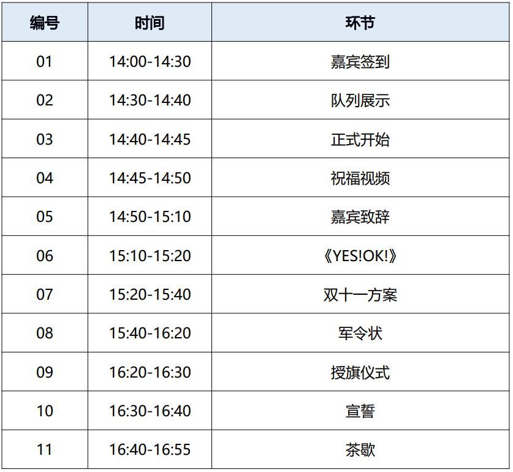

### 2、启动大会｜流程细化‌

01 【嘉宾签到环节】14:00-14:30

嘉宾签到环节是活动给予参与者的第一印象， 因此签到处的布场和人员安排非常重要。以下为本环节的建议。

+ 员工、领导分时段签到：

  员工提前签到进入会议室候场， 即能避免嘉宾领导入场时空场， 也方便摄影机跟踪记录嘉宾入场全程。

+ 工作人员安排：

  至少有四位工作人员负责所有人的签到与指引、两位礼仪小姐指引嘉宾领取嘉宾证、并在签名背板上签字、留影。三名摄影师拍摄签名背板留影照片、跟踪记录嘉宾入场全过程。

+ 现场建群：

  所有参会人员扫码进入现场群， 群内将实时更新宣传照片、视频。供参会人员发布朋友圈二次宣传使用。

+ 董事长入场设计：

  所有嘉宾、员工都在会场内坐齐。主持人引导全场人员观看董事长个人介绍短片（ 旁白文案简单介绍董事长白手起家的故事， 配合素材剪辑）， 视频结束， 屏幕切入董事长乘直升机到达现场的实时转播画面。

  正门口摆放的战鼓敲起，董事长从直升机/车中走出，走到签名背板前签名留影。随着董事长逐渐走近会议厅，会议厅门口的鼓声也响起，大门打开， 董事长在全员掌声中， 由礼仪小姐引导入场落座。

02 14:30-14:40 队列展示

利用视频开场倒计时视频， 点燃现场氛围的同时， 引出队列展示环节。

+ 开场倒计时视频：

  倒计时视频响起警告声音、告知大家战役即将打响， 配合各类战争影视素材混剪， 烘托气氛， 最后视频声音响起：“有请勇士登场！”

  队伍从大门进入， 由鲍总下指令正步走。走到舞台前， 全体立正。董事长由主持人引领上台， 检阅队列。

  董事长：“同事们辛苦啦！”

  队列齐声高喊：“为客户服务！” 03 14:40-14:45 正式开始

  主持人在演讲台后站定， 开场音乐响起， 所有人员（ 董事长、队列人员）落座后，音乐停。主持人念出开场词，介绍在场嘉宾、正式宣布本场活动开始。

  04 14:45-14:50 祝福视频

  主持人引导观众观看祝福视频。 05 14:50-15:10 嘉宾致辞

  主持人邀请董事长上台致辞。激昂的上场音乐、配合舞台追光董事长走上台，屏幕显示董事长姓名职称。随着董事长站定，屏幕背景变为大会致辞的环节字样。

  06 15:10-15:20 《YES!OK!》

  主持人念串场词后， 舞蹈团队上台。最好能够设计配合舞蹈展示的 LED 视频背景。

  07 15:20-15:40 双十一方案

  由鲍总上台讲解本次双十一方案， 我方可提供演讲 PPT 形式优化，使其更加美观，贴近活动整体风格。亦可以提供演讲优化指导，帮助演讲者更加轻松自如的进行演讲。

  08 15:40-16:20 军令状

  主持人台下念串场词， 可以和员工进行现场互动， 为工作人员布置舞台留下时间， 工作人员将桌子， 军令状、鼓等物料搬上舞台。

  舞台左右为两个战鼓，中间红布遮盖住双十一定制的撞钟/锣，等待授旗仪式揭开。

  随着鼓声响起， 各部门经理上台， 站定后， 鼓声停。各部门经理在气势磅礴的背景音乐，签下仿古卷轴样式设计的军令状。LED 背景配烽火狼烟的动效图渲染气氛。

  军令状全部签署完毕后， 由主持人引领全员台上合影留念， 并宣布进入授旗仪式环节。

  09 16:20-16:30 授旗仪式

  主持人邀请董事长上台， 随着敲鼓声再次响起， 董事长上台进行授旗仪式。董事长将定制双十一样式的战旗，交接给部门经理后，揭幕双十一的撞钟/锣， 敲响撞钟， 礼花掉落。LED 屏幕配合动作出现特效， 双十一活动正式启动。

  10 16:30-16:40 宣誓

  主持人引导进入宣誓环节， LED 屏幕背景出现宣誓环节字样。鲍总带领全体部门经理，背对舞台，面向嘉宾席董事长，根据舞台下题词器念出宣誓词。

  11 16:40-16:55 茶歇

  主持人宣布启动大会结束，并通知观众 15min 后再次入场参加新品发布会， 引导观众茶歇休息。礼仪小姐指引领导嘉宾至 VIP 休息室休息。会场内部全场清人， 仅留工作人员进行转场布置。

+ 茶歇场地：

  建议不要和活动场地同场， 可以设在会议厅外。将左右的桌椅分散布置在大厅内。茶歇统一放置， 参会人员可以自取后到各处就坐闲谈。

+ 提前准备：‌

茶歇和外场布置转成新品发布会形式， 需要提前筹备， 至少在授旗仪式时就应全部准备完毕。

### 3、新品发布会｜流程问题

此部分为暂定新品发布会流程， 有以下几个问题需要沟通解决。

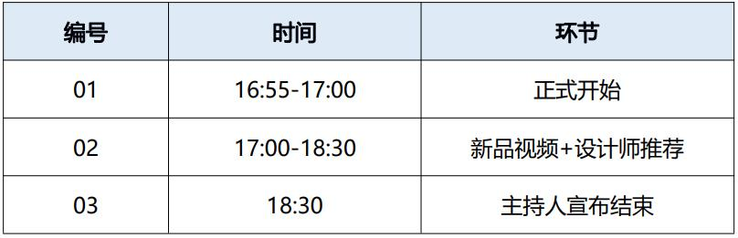

1. 时间问题：

   90 分钟介绍 10 个产品， 时间过于紧凑， 加上搬运产品上下台、播放产品视频的时间，留给设计师介绍产品的时间仅在 5min 左右。观众可能无法对产品形成较深的记忆点。

2. 舞台搬运问题：

   由于现有舞台离会议厅门的距离过于远， 会议厅内没有可以摆放产品的空间。因此建议可以在会议厅后重新搭建舞台和 LED 屏幕， 离门的距离较近， 方便产品搬运， 也可以解决现有舞台较小的问题。

3. 新品介绍 PPT：

建议删掉原有流程设定中的全部新品介绍 PPT 演示环节，直接进行新品展示， 为在场观众留下悬念。

### 4、新品发布会｜流程设计‌

01 16:55-17:00 正式开始

由主持人、礼仪小姐、工作人员指引全体参会人员归场， 主持人宣布新品发布会正式开始，并播放新品发布会视频，展示左右沙发的品牌精神。

02 17:00-18:30 新品视频+设计师推荐主持人串场进入产品发布环节。

红色幕布挡住舞台， 搬运产品上台的同时， 配合幕布外的推拉 LED

显示屏播放产品视频。视频结束，屏幕和幕布同时拉开，可采用干冰配合。

舞台上， 摆放新品发布会主题的字样的立牌代替严肃的讲台， 设计师和产品出现在大家面前， 开始正式介绍。

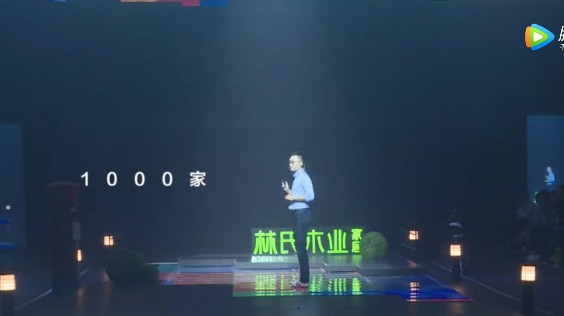

&emsp;&emsp;&emsp;&emsp;&emsp;&emsp;&emsp;&emsp;&emsp;&emsp;&emsp;&emsp;&emsp;（发布会舞台参考）

03 18:30 主持人宣布结束

主持人宣布结束后， 应指引大家至正厅楼梯处， 举起拍照横幅合照。

## 四、布场方案‌

注意： 本方案中所有参考图片， 仅为物品参考， 物料成品风格可以根据本次主题设计， 并将提供详尽的设计图稿， 定版后在进行制作。 

### 1、会场外部布场

1. 正门口

   正门口玻璃门上可贴主题海报、门上 LED 字幕滑动欢迎参会的话术。红毯从门外铺到签到处。

   大门两边各放两个战鼓并配人负责击打、两位礼仪小姐负责迎宾、场外可放主题海报展架与异形展示物。

   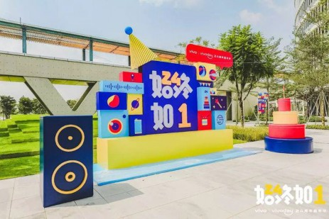

&emsp;&emsp;&emsp;&emsp;&emsp;&emsp;&emsp;&emsp;&emsp;&emsp;&emsp;（异形展示物参考）

2. 签到处

   1、签到背板： 以启动大会为主题的电影海报风格的签到背板。

   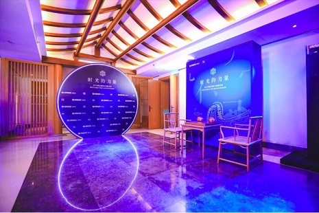

&emsp;&emsp;&emsp;&emsp;&emsp;&emsp;&emsp;&emsp;&emsp;&emsp;（签到背板参考）

   2、留影墙：异形留影墙搭配口号 KT 板（ 可做成兵器、军令状形状）

     

   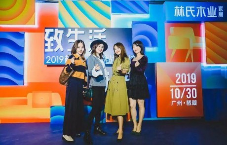

&emsp;&emsp;&emsp;&emsp;&emsp;&emsp;&emsp;&emsp;&emsp;&emsp;&emsp;&emsp;&emsp;（留影墙参考）

   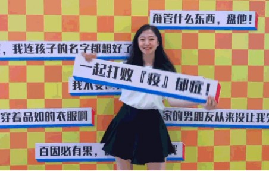

&emsp;&emsp;&emsp;&emsp;&emsp;&emsp;&emsp;&emsp;&emsp;&emsp;&emsp;&emsp;&emsp;（KT 版拍照参考）

   3、签到桌：签到桌可以做成以下形式，将文字换成报道处，整体风格模拟古代的征兵处。边上摆放立式战旗。

   

&emsp;&emsp;&emsp;&emsp;&emsp;&emsp;&emsp;&emsp;&emsp;&emsp;&emsp;&emsp;&emsp;（签到桌布置参考）

     

3. 签到处至会议厅

   签到处至会议厅的沿途摆放立牌， 正面是启动大会的海报、背面为新品发布会的宣传海报， 转场时直接翻转即可。

   同时可以配合指引地贴（ 距离战场还有 50m 之类的字样）

   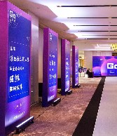

&emsp;&emsp;&emsp;（海报立牌参考）

4. 会议厅门口

会议厅门口同样摆放两个战鼓， 用来烘托董事长入场的氛围。使用异形门头， 和海报立牌进行装饰。

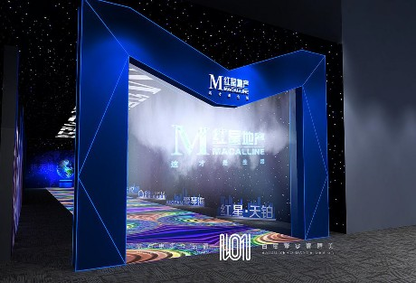

&emsp;&emsp;&emsp;&emsp;&emsp;&emsp;&emsp;&emsp;&emsp;&emsp;&emsp;&emsp;&emsp;（异形门头参考）

### 2、会场内部布场

+ 启动大会舞台布景：

   舞台布置不宜太过花哨， 因此启动大会在签署军令状环节前， 舞台上只摆放有装饰花束和主题 KT 板的宣讲台。

   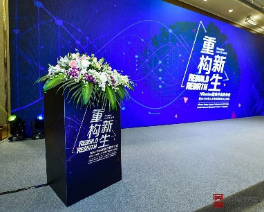

&emsp;&emsp;&emsp;&emsp;&emsp;&emsp;&emsp;&emsp;&emsp;&emsp;&emsp;（宣讲台参考）

   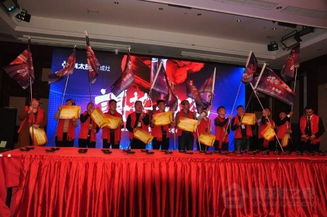

&emsp;&emsp;&emsp;&emsp;&emsp;&emsp;&emsp;&emsp;&emsp;（军令状环节道具布景参考）

+ 发布会舞台布景：

   发布会的舞台应更简约、时尚， 因此用发布会立式广告字代替宣讲台， 摆放在舞台上。

   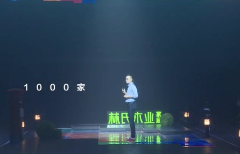

&emsp;&emsp;&emsp;&emsp;&emsp;&emsp;&emsp;&emsp;&emsp;&emsp;&emsp;&emsp;&emsp;（立式广告字参考）

+ 嘉宾席布景：

   嘉宾席摆放左右沙发的产品， 两两一组， 摆放 6-8 张沙发。两张沙发间摆放一张桌子，桌子上布置好茶水、嘉宾台签、花、左右品牌介绍画册等。

     

   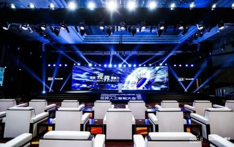

&emsp;&emsp;&emsp;&emsp;&emsp;&emsp;&emsp;&emsp;&emsp;&emsp;&emsp;&emsp;&emsp;（嘉宾席布景参考）

+ 观众席布景：‌

   观众席摆放成双十一的形状， 每个座位上放水、以及一个决战双十一定制纪念玩偶，给予每个参会员工，员工可带回工位摆放，持续提振士气。少量座位摆放战旗， 由特定员工入座， 可挥动战旗， 带动全场氛围。

     
   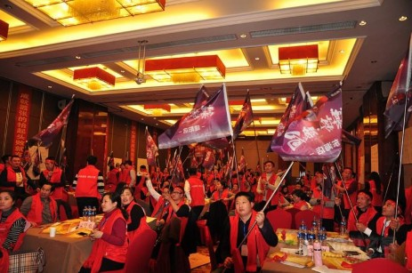

&emsp;&emsp;&emsp;&emsp;&emsp;&emsp;&emsp;&emsp;&emsp;&emsp;&emsp;&emsp;&emsp;（带动气氛参考）

+ 其他环境：

会场内需要添加其他辅助物料，可确定主题后提供完善的布景方案。  

### 3、整体布场方案

因为涉及两场活动风格不同的问题，建议现场布置配色既可以符合启动大会的军旅风格， 也可以配合新品发布会简约时尚的风格。确认主题后，会进一步确定现场布置配色方案，并提供完善的布景方案。

## 五、活动宣发‌

优秀的活动宣发， 既能提前预热活动现场， 也能够延长活动影响时效， 扩大影响范围， 是为活动造势必不可少的一环。

### 1、活动预热

01 倒计时海报： 朋友圈预热/现场物料

产品发布会预热倒计时海报的主要目的是引起外界观众的关注兴趣。因此海报内容可用描述即将发布新产品的特点文案搭配蒙着布的新产品图案轮廓， 引起受众的疑惑。

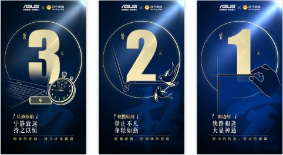

&emsp;&emsp;&emsp;&emsp;&emsp;&emsp;&emsp;&emsp;&emsp;&emsp;（产品发布会倒计时海报参考）

启动大会倒计时海报的主要目的则是引起更多未到现场的内部员工关注大会。因此要清晰的引导， 未到现场的员工， 通过直播观看本场活动。 

02 预热视频： 朋友圈预热

活动筹备期间工作、活动现场布场内容混剪， 提前发布至朋友圈宣传。

03 预热文稿： 全媒体渠道发布‌‌

提供活动预热软文稿件， 用于包含传统媒体（ 报刊）、各类门户网站、自媒体在内的全媒体渠道发布。也可提供给公司官网、公众号发布。 

### 2、活动现场：

01 活动直播记录：

活动全程直播， 并提前通知企业内部员工观看。

02 平面拍摄：

活动全程专人负责平面拍摄， 活动结束后第一时间， 提供精修照片供参会人员、发布朋友圈。

### 3、活动回顾：

1. 活动回顾短视频： 二次宣传/稿件辅助物料

   活动后当天提供活动精彩集锦， 供所有参会人员转发朋友圈， 三天内提供单人嘉宾风采短视频，供嘉宾发布朋友圈。皆为促使二次传播，让活动的影响时效、范围更大。

2. 活动回顾新闻稿：

   为现场媒体提供活动回顾新闻稿件， 可在包含传统媒体（ 报刊）、各类门户网站、自媒体在内的全媒体渠道发布。也能够在公司官网、公众号发布。

## 六、嘉宾邀请

本场活动邀请嘉宾主要为设计师、经销商、媒体三类人群代表。 

+ 嘉宾邀请函

提前一至两周时间， 向嘉宾发布正式版邀请函（ 邮件）， 以及电子邀请函， 以示尊重。

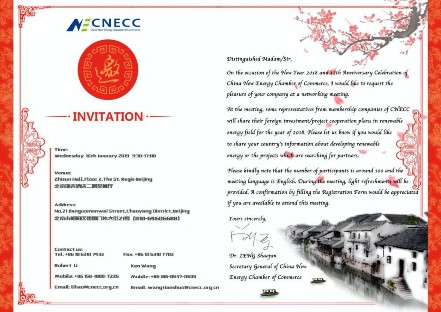

&emsp;&emsp;&emsp;&emsp;&emsp;&emsp;&emsp;&emsp;&emsp;&emsp;（正式版邀请函参考）

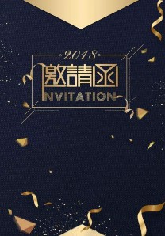

&emsp;&emsp;&emsp;（电子版邀请函参考）

+ 参会指南‌

   为嘉宾提供参会指南， 包含活动地点、活动流程、场地指引、接洽人员联系方式等内容， 帮助嘉宾更加顺畅的参与会议。

+ 专人接洽

   所有嘉宾统一由专人全程负责接洽。活动前邀请嘉宾、沟通解答嘉宾疑惑、解决嘉宾行程、住宿等问题。活动当天， 指引接待嘉宾。

+ 其他事项

   活动当天、嘉宾需佩戴嘉宾证， 活动结束后， 嘉宾可领取专属纪念品。并需为嘉宾安排饮食。

## 七、物料需求

根据前文所梳理的活动流程、布场、宣发、整理出本此活动所需额外策划、设计、制作、租赁的各类物料如下：

具体的物料设计规格、数量、材质、报价等详细内容， 待方案确定后， 再提供相关物料设计方案与制作表。

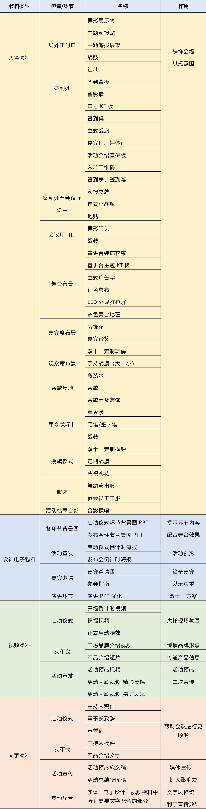

  

## 八、项目执行

### 1、团队介绍

本项目主要参与成员 30 人左右，覆盖项目统筹、文案策划、摄影指导、后期剪辑、平面设计、活动执行等全部必需岗位。  

### 2、服务明细

以下为主要管理岗位的服务内容与其工作结果。 

+ 项目统筹

负责规划、推进、调整项目进度， 把控各环节结果质量。以及活动现场人员安排调度。

提供内容： 项目推进表｜活动现场分工表｜项目资料整理提交

+ 文案策划

   负责对活动整体进行策划、以及撰写物料需求中文字物料部分内容。提供内容： 活动整体策划方案｜活动宣发方案

   物料需求中的文字物料部分

+ 摄影指导

负责把控活动现场的拍摄效果、调度灯光舞美、摄影师。

提供内容： 活动现场拍摄方案｜活动当天拍摄素材（ 照片、视频） 

+ 后期剪辑

负责本次活动的所有视频制作。

提供内容： 物料需求中的视频物料部分（ 18-20 个视频） 

+ 平面设计

负责本次活动所有的物料设计、并跟踪至制作环节。提供内容： 舞台布景方案｜物料设计方案

设计表中所有物料的设计稿｜活动现场精修图

+ 活动执行

   负责本次活动所有的物料制作、购买与租赁以及活动现场舞台搭建、布景。

   提供内容： 物料制作方案｜方案内的所有物料舞台搭建｜现场布景

+ 商务对接

负责本次活动所有的对接沟通、财务问题， 包含嘉宾对接、人员聘请、费用支付等相关事项。